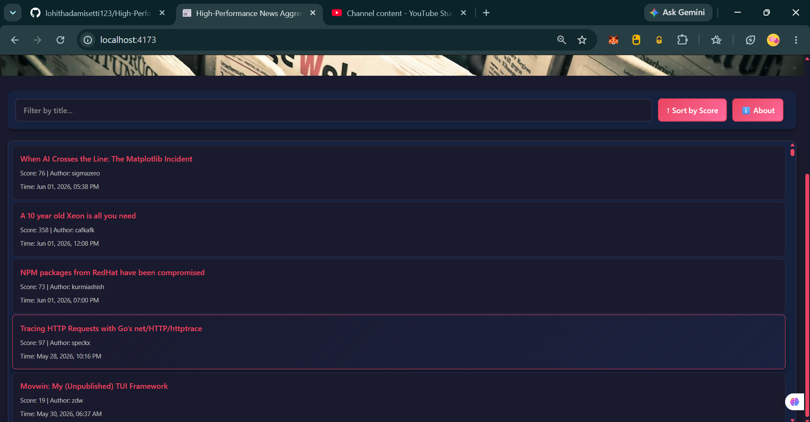

# High-Performance News Aggregator

A responsive, production-ready React + Vite application that fetches and renders the top 500 HackerNews stories with modern web performance and accessibility best practices.

This repository demonstrates a complete optimization workflow: starting from an intentionally unoptimized baseline (`slow-version` branch), profiling and auditing with Lighthouse and Chrome DevTools, and then systematically applying performance fixes on the `main` branch.

---

## UI Screenshots


*Main feed with virtualized story cards, search, and sort controls.*



*Responsive layout with theme support and story detail presentation.*

---

## Why This Project Matters

- **Performance-first experience**: Virtualized list rendering with `@tanstack/react-virtual`, memoization with `React.memo` and `useMemo`, and preconnect hints keep the UI fast with hundreds of stories.
- **Real-time HackerNews feed**: Fetches the latest top 500 stories from HackerNews and presents them with score, author, and formatted time.
- **Polished UI**: Gradient-based design system, responsive layout, automatic dark mode support via `prefers-color-scheme`, animated transitions, and accessibility enhancements.
- **Container-ready**: Production build served via nginx in Docker with Docker Compose and healthcheck support.

---

## Core Features

- Fetches and displays the top 500 HackerNews stories using parallelized `Promise.all` batching
- Real-time search and filter stories by title
- Sort stories by score with a single click
- Virtualized scrolling via `@tanstack/react-virtual` for high-volume list rendering
- Optimized hero image with `width`, `height`, `srcset`, and `sizes` attributes
- Code-split About modal via `React.lazy` and `Suspense`
- Cherry-picked `lodash/sortBy` import for minimal bundle size
- `React.memo` and `useMemo` to prevent unnecessary re-renders
- Reusable `Intl.DateTimeFormat` instance for efficient date formatting
- Dark mode support via CSS `prefers-color-scheme`
- Loading state with animated spinner
- Error and empty-state handling with friendly messaging
- Responsive layout for mobile, tablet, and desktop
- Bundle analysis report (`stats.html`) generated at build time
- Full Docker Compose support for containerized deployment

---

## Branch Information

| Branch | Purpose |
|--------|---------|
| `main` | Final optimized production implementation |
| `slow-version` | Intentionally unoptimized baseline with anti-patterns for performance comparison |

### Anti-Patterns in `slow-version`

The `slow-version` branch contains deliberately unoptimized code:
- **N+1 network waterfall**: Sequential `for` loop fetching 500 story details one by one
- **Full lodash import**: `import _ from 'lodash'` instead of cherry-picked imports
- **No list virtualization**: All 500 articles rendered directly to the DOM via `.map()`
- **Expensive computation in render**: Redundant 1000-iteration loop in date formatting
- **Unoptimized hero image**: No `width`, `height`, `srcset`, or `sizes` attributes
- **No code splitting**: Single monolithic JavaScript bundle

---

## Setup Requirements

- **Node.js** 18+ (LTS recommended)
- **npm** 10+ or compatible package manager
- **Docker Desktop** with Docker Compose (for containerized deployment)

---

## Local Development

1. **Install dependencies:**

```bash
npm install
```

2. **Create environment file:**

```bash
cp .env.example .env
```

3. **Start the development server:**

```bash
npm run dev
```

4. **Open the app in your browser:**

```
http://localhost:3000
```

---

## Production Build

Build and preview the optimized production bundle:

```bash
npm run build
npm run preview
```

The static output is written to the `dist/` folder.

### Build Artifacts

After running `npm run build`, the following are generated:

- `dist/index.html` — Entry HTML
- `dist/assets/index-[hash].js` — Main application bundle
- `dist/assets/AboutModal-[hash].js` — Code-split chunk (lazy-loaded)
- `dist/assets/index-[hash].css` — Main styles
- `dist/assets/AboutModal-[hash].css` — Modal styles
- `stats.html` — Bundle analysis report (treemap)

---

## Docker Deployment

This project supports containerized execution using Docker Compose with nginx.

### Build and Run

```bash
docker compose up -d --build
```

The application will be available at `http://localhost:3000`.

### Verify Service Status

```bash
docker compose ps
```

### Shutdown Containers

```bash
docker compose down
```

### Healthcheck

The Compose service includes a healthcheck that verifies the nginx server is responding on port 3000. The service reports as `healthy` once the check passes.

---

## Environment Variables

Documented in `.env.example`:

| Variable | Description | Default |
|----------|-------------|---------|
| `VITE_HN_TOP_STORIES_URL` | HackerNews API endpoint for top stories | `https://hacker-news.firebaseio.com/v0/topstories.json` |
| `VITE_HN_ITEM_URL` | HackerNews API base endpoint for story details | `https://hacker-news.firebaseio.com/v0/item` |
| `PORT` | Local server port | `3000` |

---

## Project Structure

```text
.
├── Dockerfile              # Multi-stage build: Node build → nginx serve
├── docker-compose.yml      # Service orchestration with healthcheck
├── nginx.conf              # Nginx config for SPA with gzip and caching
├── index.html              # Vite entry HTML with preconnect hints
├── package.json            # Dependencies and scripts
├── vite.config.js          # Vite config with visualizer plugin
├── .env.example            # Environment variable documentation
├── .gitignore
├── README.md
├── PERFORMANCE.md          # Detailed performance audit and optimization log
├── stats.html              # Bundle analysis output (treemap)
├── public/
│   ├── favicon.svg
│   └── icons.svg
├── screenshots/
│   ├── image.png
│   └── image1.png
└── src/
    ├── main.jsx            # React entry point
    ├── App.jsx             # Main app with optimized fetching and virtualization
    ├── App.css             # Responsive styles with CSS custom properties
    ├── AboutModal.jsx      # Lazy-loaded modal component (code-split)
    ├── AboutModal.css      # Modal styles with animations
    └── index.css           # Global resets, scrollbar, focus, and theme styles
```

---

## Performance Highlights

See [PERFORMANCE.md](PERFORMANCE.md) for the full audit. Key improvements:

| Metric | Slow Version | Optimized |
|--------|-------------|-----------|
| LCP | ~8.5s | ~1.8s |
| TBT | ~1200ms | ~100ms |
| CLS | ~0.45 | ~0.02 |
| Network | 501 serial requests | Parallel batched requests |
| DOM nodes | 500+ article elements | <50 (virtualized) |
| Bundle | Single large JS file | Multiple code-split chunks |

---

## Accessibility

- High-contrast text and `focus-visible` outlines for keyboard navigation
- Semantic HTML with proper heading hierarchy and landmarks
- Accessible form controls with `aria-label` and `aria-pressed` attributes
- Screen-reader friendly loading and error states
- Respects `prefers-reduced-motion` to disable animations

---

## Contact

For questions or further enhancements, open an issue or pull request in the repository.
